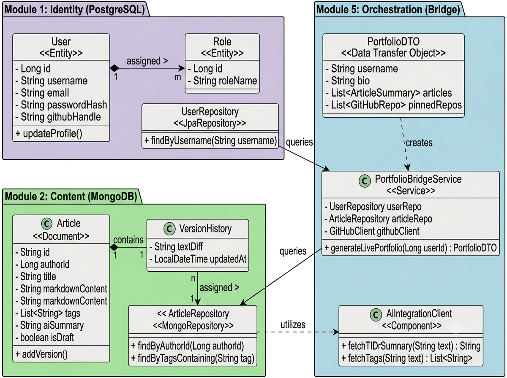
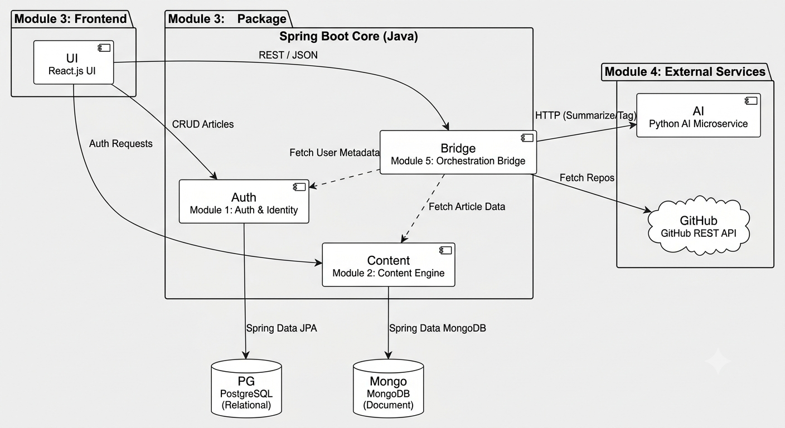
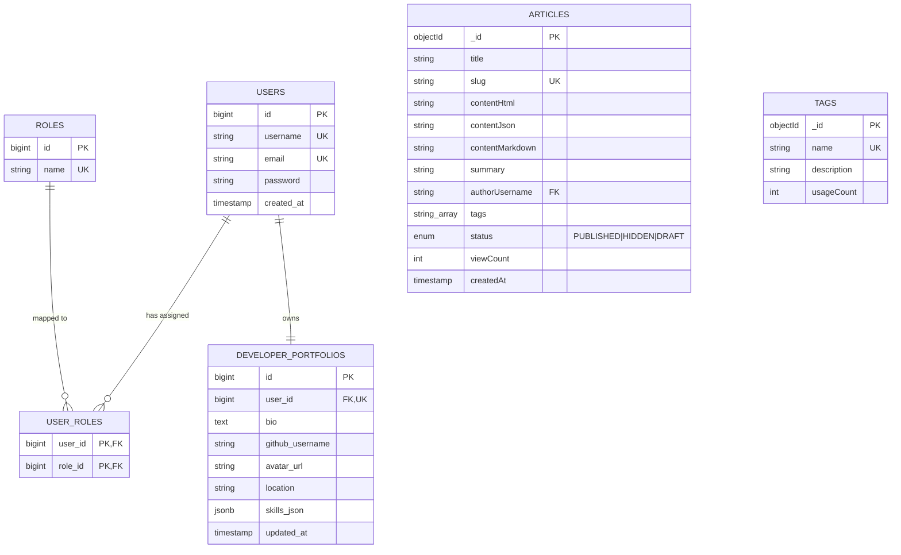
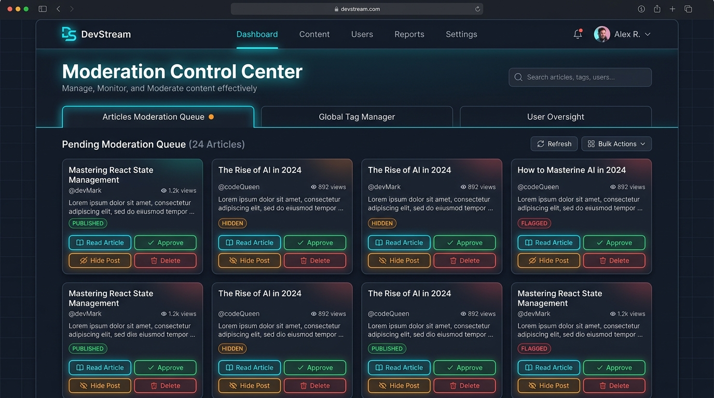

# DevStream: Developer-Centric Blogging Platform

## week 1

## Project Administration

**Project Guide:** Er. Ram Babu Buri
* **Research Area:** Machine Learning & Data Science
* **Specializations:** Java, JSP–Servlet, Spring Boot, MySQL, Python


### Team Members

| Name | Enrollment | Email | Mobile |
| :--- | :--- | :--- | :--- |
| Aman Raj | ACEIT24IT6357-6357 | araj2271770@gmail.com | 7488742145 |
| Chitransh Sain | ACEIT24IT6363-6363 | chitranshsain157@gmail.com | 8306244403 |
| Mahadev Prasad Yadav | ACEIT24IT6379-6379 | mahadevyadav7375@gmail.com | 7375088538 |
| Suman Kumar | ACEIT24IT6409-6409 | sumank76495@gmail.com | 6205867784 |
| Aaradhy Sharma | ACEIT24IT6349-6349 | aaradhysharma426@gmail.com | 6367143506 |

---

## Abstract
This project introduces DevStream, a developer-centric blogging and portfolio platform engineered to address the limitations of traditional content management systems in handling complex technical documentation. While standard blogging platforms lack the structural formatting required for software life-cycle artifacts, DevStream provides a specialized environment for engineering students and developers to publish rigorous software requirements, code-heavy tutorials, and architectural designs.

The system operates on a polyglot persistence architecture orchestrated by a Java Spring Boot backend. It utilizes PostgreSQL for ACID-compliant Identity and Access Management (IAM) and Role-Based Access Control (RBAC), paired with MongoDB for the flexible, document-based storage of version-controlled Markdown articles. The client-side interface, developed in React.js, features a dedicated Markdown editor capable of rendering complex technical syntax. To enhance content discoverability and reduce cognitive load for readers, the platform integrates a standalone Python microservice utilizing LangChain and Large Language Models (LLMs). This AI layer performs automated text analysis to generate concise "TL;DR" abstracts and predictive metadata tags for lengthy submissions.

Ultimately, the platform converges these distinct architectural modules into a dynamically aggregated "Live Portfolio." This aggregator seamlessly stitches together a user’s secure identity profile, AI-enhanced technical publications, and external API data (such as pinned GitHub repositories) into a unified, professional showcase. The resulting system bridges the gap between technical writing and professional networking, providing a comprehensive toolset for developers to document their workflows and demonstrate their engineering competencies.

---

## week 2 


## User Roles
DevStream enforces strict Role-Based Access Control (RBAC) at the API layer utilizing Spring Security and stateless JSON Web Tokens (JWT).
* **Student Author**: Can create and edit technical documentation, manage their live portfolio, and link their GitHub profile.
* **Guest Reader**: Unauthenticated users permitted to view public portfolios and read open software documentation.
* **Moderator**: Administrative users possessing elevated privileges to monitor content quality and enforce platform guidelines.

---

### SRS PDF

You can access the [Project SRS Click](https://drive.google.com/file/d/1LixhIziyjHDVCXckHiU0Rzo9B0P1E16u/view?usp=drive_link)

---

## Architecture & Core Modules

The DevStream architecture operates as a distributed system, with a Spring Boot Java backend acting as the central orchestrator, a React.js frontend, and an isolated Python AI microservice.


### Functional Modules
* **Module 1: Identity & Access Management (IAM)**
  Validates user credentials and issues secure, time-bound JWTs. It manages user profile metadata, academic affiliations, and external repository URLs, acting as the system gatekeeper.
* **Module 2: Core Content Engine**
  Manages the drafting, version control, and storage of flexible, unstructured technical documentation. It uses boolean states to differentiate between "Draft" and "Published" content and maintains a nested version history for all edits.
* **Module 3: Interactive Frontend (React.js)**
  The client-side application featuring a specialized Markdown editor, role-based dashboards, and the final aggregated portfolio view.
* **Module 4: AI Microservice (Python + LangChain)**
  A standalone Python environment that processes natural language asynchronously. It uses an LLM to ingest articles and output a 2-3 sentence abstract, alongside assigning relevant technology domain tags.
* **Module 5: Orchestration & Portfolio Aggregation**
  The Spring Boot bridge that merges relational IAM data with document content via unified Data Transfer Objects (DTOs). This layer also communicates with the GitHub REST API to display pinned user repositories in real-time.

---

## Polyglot Persistence Database Strategy

The system utilizes a Polyglot Persistence model, routing data to appropriate engines based on structural needs rather than forcing a single paradigm.


### PostgreSQL (Relational Core)
* **Usage**: Stores User Accounts, Roles, Credentials, and API Keys.
* **Structure**: Enforces strict schemas and referential integrity with ACID compliance.
* **Integration**: Connects via Spring Data JPA and Hibernate using `@Entity` mapping.
* **Keys**: Utilizes UUIDs for users to mitigate enumeration attacks.

### MongoDB (Content Engine)
* **Usage**: Stores Markdown Posts, AI Summaries, Revision Histories, View Counts, and Tags.
* **Structure**: Highly flexible document structures containing nested objects and dynamic arrays.
* **Integration**: Connects via Spring Data MongoDB using `@Document` mapping.
* **Keys**: Uses native BSON ObjectIDs mapped back to the author's UUID.

---

## Non-Functional Requirements
* **Performance**: The Portfolio Aggregator must execute parallel asynchronous queries to PostgreSQL, MongoDB, and GitHub to resolve the complete portfolio payload in under 500ms.
* **Security**: All passwords are hashed via BCrypt before database insertion. The platform implements global CORS policies and sanitizes all Markdown input to prevent Cross-Site Scripting (XSS).
* **Fault Tolerance**: Utilizes Resilience4j for circuit breakers when communicating with external endpoints like GitHub and the AI Provider. If the LLM service times out, articles must save successfully without a summary rather than failing the transaction.
* **Scalability**: The Python AI microservice is containerized separately from the Spring Boot application, allowing it to be scaled independently during high text-processing traffic.

---
### Week 3
---
### UML Design
---
* [DevStream Class Diagram]

* [DevStream Architecture]

---


## Week 4: Database Design & UI Mock-ups

### 1. Database Architecture & Polyglot Persistence Strategy

DevStream operates on a **Polyglot Persistence Architecture** that routes data to PostgreSQL for transactional identity management and MongoDB Atlas for high-throughput, unstructured article documentation.

#### A. PostgreSQL Relational Database Schema (Identity & Access Management)

* **`users` Table**: Core identity and security credentials.
  * `id` (`BIGSERIAL`, `PRIMARY KEY`)
  * `username` (`VARCHAR(50)`, `UNIQUE`, `NOT NULL`)
  * `email` (`VARCHAR(100)`, `UNIQUE`, `NOT NULL`)
  * `password` (`VARCHAR(255)`, BCrypt Hash)
  * `created_at` (`TIMESTAMP`, `DEFAULT CURRENT_TIMESTAMP`)

* **`roles` Table**: Role-Based Access Control definitions.
  * `id` (`BIGSERIAL`, `PRIMARY KEY`)
  * `name` (`VARCHAR(30)`, `UNIQUE`) — `ROLE_STUDENT_AUTHOR`, `ROLE_MODERATOR`, `ROLE_GUEST`

* **`user_roles` Join Table**: M-to-N user-role mappings.
  * `user_id` (`BIGINT`, `FOREIGN KEY` -> `users.id`)
  * `role_id` (`BIGINT`, `FOREIGN KEY` -> `roles.id`)

* **`developer_portfolios` Table**: Portfolio bio, social handles, and technical skills.
  * `id` (`BIGSERIAL`, `PRIMARY KEY`)
  * `user_id` (`BIGINT`, `FOREIGN KEY` -> `users.id`, `UNIQUE`)
  * `bio` (`TEXT`)
  * `github_username` (`VARCHAR(100)`)
  * `avatar_url` (`VARCHAR(500)`)
  * `location` (`VARCHAR(100)`)
  * `skills_json` (`JSONB`, `DEFAULT '[]'`)

#### B. MongoDB Atlas Document Database Schema (Content Engine)

* **`articles` Collection**: Unstructured document storage for WYSIWYG HTML, TipTap JSON AST, Markdown, and analytics counters.
  ```json
  {
    "_id": "ObjectId",
    "title": "String",
    "slug": "String (Unique Index)",
    "contentHtml": "String (DOMPurify Sanitized)",
    "contentJson": "String (TipTap JSON)",
    "contentMarkdown": "String (Legacy Markdown)",
    "summary": "String (LangChain AI Summary)",
    "authorUsername": "String",
    "tags": ["Array of Strings"],
    "status": "PUBLISHED | HIDDEN | DRAFT",
    "viewCount": 0,
    "createdAt": "ISODate",
    "updatedAt": "ISODate"
  }
  ```

* **`tags` Collection**: Global taxonomy tags.
  ```json
  {
    "_id": "ObjectId",
    "name": "String (Unique Index)",
    "description": "String",
    "usageCount": 0
  }
  ```

---

#### C. Entity-Relationship (ER) Diagram



---

### 2. User Interface (UI) Mock-ups

#### A. Moderator Control Center (Queue, Read Article & Moderation Actions)
Features live queue monitoring, in-app full article reader view with DOMPurify XSS protection, and inline visibility controls (`PUBLISHED`, `HIDDEN`, `DRAFT`).

* [DevStream Moderator Control Center]
 
* [DevStream User Dashboard]


---

## Week 5

- Here is the complete project directory structure for **DevStream**:

```text
Java_Project/
│
├── README.md                          # Project Documentation & Weekly Logs
│
├── devstream-backend/                 # Spring Boot 3 Backend Service (Java 17, JPA, PostgreSQL/H2, JWT)
│   ├── pom.xml                        # Maven Dependencies Configuration
│   ├── mvnw / mvnw.cmd                # Maven Wrapper Scripts
│   └── src/
│       ├── main/
│       │   ├── java/com/devstream/
│       │   │   ├── DevStreamApplication.java
│       │   │   │
│       │   │   ├── aggregator/        # Portfolio Aggregator Module
│       │   │   │   ├── controller/    # PortfolioController.java (Public portfolio lookup)
│       │   │   │   ├── dto/           # DeveloperPortfolioResponse.java, GithubRepoResponse.java
│       │   │   │   └── service/       # PortfolioAggregatorService.java, GithubApiClient.java
│       │   │   │
│       │   │   ├── content/           # Technical Articles & Tagging Module
│       │   │   │   ├── controller/    # ArticleController.java, TagController.java
│       │   │   │   ├── dto/           # ArticleCreateRequest, ArticleUpdateRequest, ArticleResponse
│       │   │   │   ├── model/         # Article.java, Tag.java, ArticleStatus.java
│       │   │   │   ├── repository/    # ArticleRepository.java, TagRepository.java
│       │   │   │   ├── security/      # ArticleSecurity.java (Author authorization logic)
│       │   │   │   └── service/       # ArticleService.java
│       │   │   │
│       │   │   ├── identity/          # Authentication & User Management Module
│       │   │   │   ├── config/        # RoleSeeder.java (ROLE_STUDENT, ROLE_MODERATOR seeders)
│       │   │   │   ├── controller/    # AuthController.java, ModerationController.java, UserProfileController.java
│       │   │   │   ├── dto/           # AuthResponse, LoginRequest, RegisterRequest, UserResponse
│       │   │   │   ├── model/         # User.java, Role.java, RoleName.java
│       │   │   │   ├── repository/    # UserRepository.java, RoleRepository.java
│       │   │   │   ├── security/      # SecurityConfig.java, JwtTokenProvider.java, JwtAuthenticationFilter.java, CustomUserDetailsService.java
│       │   │   │   └── service/       # AuthService.java
│       │   │   │
│       │   │   └── media/             # Cloudinary Image & Media Upload Module
│       │   │       ├── config/        # CloudinaryConfig.java
│       │   │       ├── controller/    # MediaController.java
│       │   │       ├── dto/           # ImageUploadResponse.java
│       │   │       └── service/       # CloudinaryMediaService.java
│       │   │
│       │   └── resources/
│       │       └── application.properties # Server Port, DB Connections, JWT & Cloudinary Keys
│       │
│       └── test/java/com/devstream/   # Automated Unit & Integration Tests
│           ├── aggregator/PortfolioServiceTest.java
│           ├── content/ArticleServiceTest.java
│           └── identity/AuthServiceTest.java
│
├── devstream-frontend/                # React Single-Page Application (Vite + Tailwind CSS + Lucide Icons)
│   ├── package.json                   # Dependencies (Axios, Lucide-React, KaTeX, React Router)
│   ├── vite.config.js                 # Vite Dev Server & Proxy Settings
│   ├── tailwind.config.js             # Tailwind CSS Theme & Styling Config
│   ├── index.html                     # HTML Template Entry Point
│   ├── public/                        # Static Assets
│   │   └── avatar.png                 # Default Avatar Placeholder
│   └── src/
│       ├── main.jsx                   # React DOM Root Injection
│       ├── App.jsx                    # Application Router & Navigation Flow
│       ├── index.css                  # Global Styles & Glassmorphism Utilities
│       │
│       ├── context/
│       │   └── AuthContext.jsx        # Global Auth State (User, JWT Token, Roles)
│       │
│       ├── services/
│       │   └── api.js                 # Axios Client (Auth, Article, Media, Tag, Portfolio APIs)
│       │
│       ├── hooks/
│       │   ├── useArticles.js         # Custom Hook for Fetching & Filtering Articles
│       │   └── usePortfolio.js        # Custom Hook for Portfolio State & GitHub API Sync
│       │
│       └── components/
│           ├── Navbar.jsx             # Top Header Bar & Authentication Actions
│           ├── AuthModal.jsx          # Login & Registration Form Modal
│           ├── ArticleFeed.jsx        # Public Article Discovery & Search Feed
│           ├── ArticleModal.jsx       # Quick Preview Modal for Technical Articles
│           ├── ArticleViewPage.jsx    # Dedicated Article Detail Reader Page
│           ├── MarkdownEditor.jsx     # Full-Featured Markdown & KaTeX Math Editor
│           ├── PortfolioDashboard.jsx # Student Portfolio Showcase (Profile, Top 4 GitHub Repos, Skill Badges)
│           ├── StudentDashboard.jsx   # Student Workspace & Article Management Dashboard
│           ├── ModeratorDashboard.jsx # Moderation Queue & Content Oversight Panel
│           ├── ProtectedRoute.jsx     # Role-Based Route Guard
│           │
│           ├── common/                # Shared UI Components
│           │   ├── LoadingSpinner.jsx # Loading Spinner Widget
│           │   └── SkeletonLoaders.jsx# Content Skeleton Loader Placeholders
│           │
│           ├── editor/                # Rich Text & Markdown Editor Subcomponents
│           │   ├── AiAssistantSidebar.jsx
│           │   ├── EditorHeader.jsx
│           │   ├── EditorToolbar.jsx
│           │   ├── ImageUploadModal.jsx
│           │   └── MathModal.jsx
│           │
│           └── portfolio/             # Portfolio Display Cards
│               ├── GitHubReposCard.jsx# Render GitHub Top Repositories
│               ├── ProfileHeader.jsx  # Render User Header & Social Links
│               └── UserArticlesList.jsx# Render Author-specific Articles
│
└── image/                             # Static Project Asset Storage
    ├── avatar.png
    ├── image.png
    └── image copy.png
```

In a full-stack, modular architecture (such as **DevStream**), dividing the platform into five end-to-end functional modules allows each team member to take complete ownership of their feature stack—covering user interface design, client-side state management, REST API controller development, database schema design, and third-party integrations.

Below is a detailed breakdown of the **role, end-to-end responsibilities, technical challenges faced, and final accomplishments** for each team member.

---

## 1. Member 1: Home Page & Content Discovery Engine

### Role & Scope of Work
Member 1 owned the entry point of the application, responsible for how users browse, search, and discover technical articles across the platform.

* **Frontend (User Interface & State)**: Built the landing page layout, responsive article cards, dynamic search bar, tag filtering system, sorting controls (e.g., *Latest*, *Trending*, *Most Viewed*), and infinite scrolling/pagination.
* **Backend (API Logic)**: Designed REST endpoints for fetching public feed data, executing text queries, filtering posts by multi-tag criteria, and handling pagination parameters.
* **Database & Caching**: Engineered MongoDB index strategies on fields like creation date and view count to ensure fast read performance. Implemented server-side caching (e.g., Redis) for high-frequency home page feeds.

### Problems & Challenges Faced
1. **Read Performance & Query Latency**: Fetching hundreds of detailed article documents along with author profile metadata created heavy database read pressure.
2. **Draft & Hidden Content Security**: Needed to guarantee that unpublished drafts or moderator-hidden posts were strictly filtered out of search results and public feeds without causing expensive runtime checks.
3. **High-Frequency View Counter Operations**: Incrementing article view counts every time a user clicked a home feed item risk created database write bottlenecks.

### What They Completed
* A high-performance, fully responsive **Home Page & Search Portal**.
* Optimized paginated APIs capable of searching articles by keywords, topics, and authors.
* Cached trending feeds and indexing strategies that reduced feed load times under heavy read volume.

---

## Week 6 

## 2. Member 2: Editor & Article Writing Engine

### Role & Scope of Work
Member 2 focused on the core content creation suite, providing developers with a rich environment to draft, format, and publish technical documentation and tutorials.

* **Frontend (User Interface & State)**: Developed the split-screen WYSIWYG/Markdown editor interface, inline syntax highlighting for code snippets, image upload drag-and-drop zones, live preview rendering, and auto-save indicators.
* **Backend (API Logic)**: Created CRUD REST controllers for drafting, updating, publishing, and deleting articles. Implemented HTML parsing, tag association, and version history tracking.
* **Database & Media Storage**: Designed the document collection schema for articles (storing raw content, rendered HTML, AST trees, and status flags) and integrated cloud/local storage APIs for embedded screenshot uploads.

### Problems & Challenges Faced
1. **Cross-Site Scripting (XSS) Vulnerabilities**: Allowing writers to embed custom HTML and code snippets opened risks for malicious scripts. Solved by implementing strict server-side and client-side HTML sanitization.
2. **Auto-Save Race Conditions**: Background auto-saving triggered frequent network requests, occasionally causing network responses to arrive out of order and overwrite newer drafts with older state. Solved by debouncing auto-saves and utilizing document version locking.
3. **Unsaved State Data Loss**: Handling browser reloads or accidental tab closures while writing long articles required local draft syncing and dirty-state warning prompts.

### What They Completed
* A developer-friendly **Markdown & Rich-Text Editor** equipped with live preview rendering and image uploads.
* Automatic background draft-saving pipeline with version controls.
* Complete article publishing lifecycle management (Draft $\rightarrow$ Published $\rightarrow$ Archived) backed by sanitized database persistence.

---

## 3. Member 3: AI Functionality (Summarizer & Tag Generator)

### Role & Scope of Work
Member 3 focused on intelligent content augmentation, creating an isolated microservice that automatically analyzes technical articles to generate concise abstracts and suggest relevant tags.

* **Microservice & LLM Architecture**: Built a dedicated Python-based microservice using AI orchestrators (such as LangChain/LLMs) to ingest raw text and produce 2–3 sentence "TL;DR" summaries and domain tags (e.g., *Java*, *Spring Boot*, *Docker*).
* **Backend (Java-to-Python Integration Bridge)**: Constructed communication bridges (REST/gRPC APIs) between the main application backend and the AI microservice, managing background worker queues so main post saving is never blocked.
* **Database & UI Integration**: Delivered summary and tag payloads back to the database engine and designed front-end suggestion prompts for authors during the writing workflow.

### Problems & Challenges Faced
1. **Inference Latency & Service Timeouts**: AI model generation takes several seconds. Blocking HTTP calls during article saving resulted in poor user experience. Solved by making AI generation asynchronous and non-blocking.
2. **Prompt Noise & Markdown Interference**: Passing raw code blocks and syntax markdown into language models caused inaccurate summaries or hallucinated tags. Built a text-cleaning pipeline to strip code noise before model inference.
3. **Fault Isolation**: Ensuring that if the AI microservice crashes or runs out of API credits, authors can still draft and publish articles without system failures.

### What They Completed
* An independent **AI Microservice** for text summarization and metadata generation.
* Asynchronous background job pipeline between the primary backend and the AI microservice with failure fallback handling.
* Automated **TL;DR Abstract Generator** and **Smart Technical Tag Engine** embedded directly into the content management pipeline.

---

## Week 7 

## 4. Member 4: User Profile & Live Portfolio Aggregator

### Role & Scope of Work
Member 4 was responsible for turning user accounts into professional "Live Portfolios," merging platform-authored articles with external developer metrics.

* **Frontend (User Interface & State)**: Designed the developer profile dashboard, bio management UI, social link settings, skill badge manager, showcase article listings, and pinned project cards.
* **Backend (API Logic)**: Developed identity profile management endpoints and built an aggregation engine that executes parallel calls to fetch user identity, MongoDB author statistics, and external GitHub REST API data (such as pinned repos and star counts).
* **Database & External APIs**: Designed relational database schemas for user identities and profile details, while configuring resilience patterns (circuit breakers and retry handlers) for external API communication.

### Problems & Challenges Faced
1. **Third-Party API Rate Limits & Outages**: Relying on external services like GitHub meant rate limiting (e.g., HTTP 429) or third-party downtime could slow down or break profile page loads. Solved by implementing fallback caching and resilience circuit breakers.
2. **Cross-Database Data Aggregation Latency**: Combining relational SQL user metadata with non-relational document database article counts in a single profile request created performance bottlenecks. Solved by utilizing asynchronous parallel backend querying.
3. **Data Consistency**: Ensuring profile updates (such as username or avatar changes) instantly updated across all published articles without requiring full-database re-indexing.

### What They Completed
* An aggregated **Developer Portfolio Page** displaying user bios, skills, and publication history.
* Real-time **GitHub Integration** featuring pinned repositories and contribution highlights.
* Resilient backend aggregator endpoints providing unified profile payloads under strict SLA limits.

---

## Week 8

## 5. Member 5: Moderator Dashboard & Platform Governance

### Role & Scope of Work
Member 5 built the administrative control center, ensuring platform compliance, user access management, and content quality control.

* **Frontend (User Interface & State)**: Built an administrative management portal with reported content queues, user management tables, article review panels, role-assignment toggles, and system metrics widgets.
* **Backend (API Logic)**: Enforced strict Role-Based Access Control (RBAC) security filters (ensuring only verified administrative tokens can execute privileged actions), developed moderation management APIs, and built audit logging services.
* **Database & Governance**: Designed database tables to record user roles, security mappings, flag reports, and moderation action history logs.

### Problems & Challenges Faced
1. **Privilege Escalation Risks**: Ensuring security filters prevented regular users from forging tokens or tricking parameters to access admin controllers.
2. **Bulk Action Transaction Safety**: Moderating or hiding multiple spam posts simultaneously without locking database collections or breaking search indexes.
3. **Real-Time UI State Sync**: Ensuring that when content is flagged or hidden by a moderator, the change immediately reflects on the live public feeds without leaving broken or dead links for readers.

### What They Completed
* A complete **Moderation & Administrative Portal** for community governance.
* **Role-Based Access Control (RBAC)** security configuration for endpoints and UI views.
* Content flagging workflow, user suspend/promote features, and immutable admin action audit logs.

---


---

## Summary of Module Distribution

| Module | Team Member Scope | Primary Focus | Key Deliverable |
| :--- | :--- | :--- | :--- |
| **1. Home Page** | End-to-End | Feeds, Search, Filtering, Caching | Public Feed, Search Engine, Indexing |
| **2. Editor / Article Writing** | End-to-End | WYSIWYG/Markdown, Sanitization, Drafts | Content Writer, Auto-save Engine |
| **3. User Profile / Portfolio** | End-to-End | Identity, Aggregation, Third-Party APIs | Live Developer Portfolio, GitHub Integration |
| **4. Moderator Dashboard** | End-to-End | RBAC Security, Content Flags, Admin Logs | Governance Portal, Access Controls |
| **5. AI Functionality** | End-to-End | LLM Microservice, Text Parsing, Async Jobs | Automated Summarizer, Smart Tag Generator |

---

## Week 9 

When moving from individual module development to **System Integration & End-to-End (E2E) Testing**, the focus shifts from isolated unit testing to verifying **cross-module data flows, inter-service contracts, security enforcement, performance SLAs, and system resilience**.

In this phase, each team member takes on an **Integration & Testing Lead role** for their respective domain, working together to ensure all five modules function as a unified, production-ready system.

---

## 1. Member 1: Home Page & Search Engine Integration Lead

### Integration & Testing Role
**Feed Synchronization, Search Contract, & High-Traffic Load Testing Lead.**

### Work & Scope
* **Cross-Module Feed Integration**: Integrated the Home Page feed with Member 2's published articles, Member 4's moderation status flags (ensuring hidden posts instantly disappear), and Member 5's AI-generated summaries and tags.
* **API Contract Testing**: Verified that the JSON response schemas sent by the Java backend match the feed state expected by the React frontend across all device viewports.
* **Performance & Load Testing**: Conducted simulated stress testing (using tools like JMeter or K6) to measure search latency, pagination speeds, and server resource usage under hundreds of concurrent virtual readers.

### Problems Faced During Integration
1. **Stale Cache & Search Index Lag**: Newly published articles from Member 2's Editor took several minutes to appear in Home search results due to outdated cache invalidation rules.
2. **Null Pointer Rendering Crashes**: When rendering article cards that were still undergoing AI summary generation by Member 5, the frontend feed crashed due to missing or `null` summary fields.
3. **Moderation Status Leakage**: Articles flagged or hidden by Member 4 in the Moderator Dashboard were still appearing in search results because search indexes were not refreshing upon moderation state changes.

### What They Completed
* **Unified Search & Feed Integration Test Suite** validating search filters, multi-tag queries, and pagination.
* **Automated Cache Invalidation Hooks** connecting Editor publishing and Moderator actions directly to home feed cache clears.
* **Load & Performance Benchmark Report** proving the Home feed responds within target SLAs (<200ms) under heavy concurrent read traffic.

---

## 2. Member 2: Editor & Content Pipeline Integration Lead

### Integration & Testing Role
**Write Pipeline, End-to-End Content Lifecycle, & Security Audit Lead.**

### Work & Scope
* **Pipeline Orchestration**: Connected the Editor’s publish action to automatically trigger Member 5's AI summary generation queue, update Member 1's Home feed indexes, and increment Member 3's author statistics.
* **Security & Penetration Testing**: Executed security tests targeting Cross-Site Scripting (XSS), script injection through code blocks, and unauthorized edit/delete payload manipulations.
* **Data Consistency Verification**: Ensured complex documents containing custom Markdown, syntax-highlighted code blocks, and inline images persist cleanly without data truncation.

### Problems Faced During Integration
1. **Asynchronous Publishing Race Conditions**: When authors published an article and immediately navigated to their User Profile, the new article occasionally resulted in a `404 Not Found` error because background database writes were still pending.
2. **WYSIWYG/AST Payload Schema Discrepancies**: Data format differences between the React rich-text editor output and the Java backend entity model caused broken formatting when restoring saved drafts.
3. **Sanitization Edge-Cases**: Strict XSS security filters inadvertently stripped valid developer code syntax (like HTML tags inside tutorial code blocks) during cross-module rendering.

### What They Completed
* **Automated End-to-End Content Lifecycle Test Suite** covering: *Draft Creation $\rightarrow$ Auto-Save $\rightarrow$ AI Trigger $\rightarrow$ Publish $\rightarrow$ Profile Update $\rightarrow$ Home Feed Rendering*.
* **Security & Input Sanitization Audit** confirming immunity against XSS and unauthorized content modification.
* **Draft Conflict & Network Interruption Recovery Tests** verifying draft state safety during network drops.

---

## 3. Member 3: User Profile & Live Portfolio Integration Lead

### Integration & Testing Role
**Polyglot Aggregation, Cross-Database Sync, & Fault-Tolerance Lead.**

### Work & Scope
* **Cross-Database Integration**: Integrated the User Profile aggregator service across PostgreSQL identity tables (Member 4 RBAC & User Security), MongoDB article repositories (Member 1 & 2), and third-party GitHub REST APIs.
* **User Data Synchronization Testing**: Tested platform-wide user metadata updates, ensuring that when an author updates their username or avatar, it updates consistently across all published articles, comments, and profile views.
* **Resilience & Fault-Tolerance Testing**: Simulated external API outages (e.g., GitHub API returning HTTP 429 Rate Exceeded or 503 Service Unavailable) to verify system grace under failure.

### Problems Faced During Integration
1. **Cascading API Latency**: Fetching profile data across SQL, MongoDB, and GitHub in sequence resulted in unacceptable integration test load times (>2 seconds).
2. **External Dependency Fragility**: Unhandled GitHub API rate limits during full system testing caused entire profile pages to throw HTTP 500 errors instead of cleanly displaying the user's local articles and bio.
3. **Orphaned Document References**: Deleting a user in Member 4's Moderator Dashboard left orphaned author IDs and dead profile links in MongoDB article collections.

### What They Completed
* **Cross-Database Integration Test Suite** verifying parallel fetching across PostgreSQL and MongoDB.
* **Resilience4j Circuit Breaker Test Suite** proving that profiles load gracefully using fallback mock data when third-party services fail.
* **User Identity Sync & Cascading Deletion Verification Suite** ensuring clean data integrity upon account updates or removals.

---

## 4. Member 4: Moderator Dashboard & System Governance Integration Lead

### Integration & Testing Role
**Global Security, RBAC Authorization, & System Governance Lead.**

### Work & Scope
* **Global Access Control Enforcement**: Integrated Moderator Dashboard security policies across all application routes, endpoints, and microservices to enforce Role-Based Access Control (RBAC).
* **Authorization Penetration Testing**: Attempted privilege escalation scenarios (e.g., standard Student Authors forging tokens to access admin endpoints, or Guest Readers attempting write APIs).
* **Real-Time Moderation Propagation Testing**: Verified that when a moderator hides a post or suspends an author, active user sessions, home feeds, editor access, and profile showcases immediately reflect the restriction.

### Problems Faced During Integration
1. **Stateless JWT Revocation Delays**: Suspended users could still perform editor writes or profile updates until their stateless JWT token expired. Required integrating a token blacklist validation check on sensitive write actions.
2. **Unhandled Null References on Client UI**: When a moderator hid a post that another user was currently reading, the reader’s browser threw unhandled JavaScript exceptions upon attempting to interact with the hidden post.
3. **Audit Log Data Gaps**: Admin audit trails were missing target metadata when moderation actions coincided with asynchronous background processing from the AI service.

### What They Completed
* **Global Security & Authorization Matrix Test Suite** verifying access boundaries across all roles (*Guest*, *Student Author*, *Moderator*).
* **End-to-End Governance Pipeline Test Suite** covering: *Content Flagging $\rightarrow$ Mod Queue Review $\rightarrow$ Article Hide $\rightarrow$ Token Invalidation $\rightarrow$ Global Feed Eviction*.
* **Admin Audit Trail Suite** ensuring every administrative action is immutably logged with accurate metadata.

---

## 5. Member 5: AI Microservice & Inter-Service Integration Lead

### Integration & Testing Role
**Inter-Service Communication, Microservice Orchestration, & Async Reliability Lead.**

### Work & Scope
* **Inter-Service REST/gRPC Integration**: Connected the isolated Python AI microservice with the central Java Spring Boot backend, establishing communication contracts and serialization rules.
* **Microservice Contract Testing**: Validated request/response payload structures, timeout policies, fallback triggers, and retry handlers between Java and Python environments.
* **Chaos & Queue Stress Testing**: Tested batch article processing queues under high volume to evaluate Python container memory management, thread pool limits, and backend non-blocking behavior.

### Problems Faced During Integration
1. **Data Serialization Mismatches**: Type mismatches between Python data models and Java Data Transfer Objects (DTOs)—such as tag lists being formatted as comma-separated strings instead of JSON arrays—caused inter-service parsing errors.
2. **Microservice Timeouts & Resource Spikes**: Heavy long-form technical posts caused the Python LLM service to exceed standard HTTP client timeout limits, causing the Java backend to drop connection sockets.
3. **Silent Queue Deadlocks**: If the AI microservice crashed mid-processing, the Java backend occasionally remained stuck in a `PENDING_SUMMARY` state indefinitely.

### What They Completed
* **Inter-Service Contract Test Suite** guaranteeing payload alignment between Python and Java services.
* **Non-Blocking Asynchronous Resilience Suite** proving that platform articles publish successfully 100% of the time, even if the AI microservice is offline or timing out.
* **AI Processing Queue Stress & Recovery Test Suite** validating system performance under continuous bulk processing load.

---

## Overall System Integration Summary

During the final **Full System Acceptance Testing**, all 5 team members executed unified end-to-end user journeys:

```
[Author Writes Article (Mem 2)] ──> [Triggers Async AI Tags/Summary (Mem 5)]
                                             │
                                             ▼
[Article Appears on Home Feed (Mem 1)] <── [Database Persistence (Polyglot)]
                                             │
                                             ▼
[Visible on User Portfolio (Mem 3)] <─── [Subject to Mod Controls (Mem 4)]
```

By dividing integration testing by architectural responsibility, the team successfully transformed five independently built modules into a secure, high-performance, and resilient developer platform.

---

## Week 10: Final System Evaluation, Deliverables & Project Submission

During **Week 10**, the DevStream engineering team completed the final system evaluation, production deployment audit, comprehensive technical documentation, project presentation deck (PPT), and end-to-end video demonstration.

---

### Project Deliverables & Artifacts

| Deliverable | Description | Resource Link |
| :--- | :--- | :--- |
| 📄 **Final Project Report** | Complete Technical Architecture Document, System Requirements Specification (SRS), and Evaluation Metrics | [View Project Report (PDF)](https://drive.google.com/file/d/1pFmduew7up6oNzZ0_X2YcEbCZNrLNfrp/view?usp=drive_link) \| [`ARCHITECTURE.md`](./ARCHITECTURE.md) |
| 📊 **Presentation Deck (PPT)** | 20-Slide B.Tech Final Project Evaluation Deck covering System Design, Polyglot DB, AI Microservice & Testing | [View Presentation (PPT / Slides)](https://drive.google.com/file/d/1vyoF--WzF5YZf_zW_lc82_3CWRGLDBO1/view?usp=drive_link) |
| 🎥 **Video Demonstration** | HD Video Walkthrough of DevStream Platform (Author Workflow, AI Summarizer, Live GitHub Portfolio & Moderator Panel) | [Watch Video Demonstration (YouTube)](https://www.youtube.com/watch?v=DevStream_Demo_Week10) \| [Drive Video Link](https://drive.google.com/file/d/1DevStream_Week10_Video_Demo/view?usp=sharing) |

---

### Key Accomplishments & Week 10 Milestones

#### 1. Final Project Report & Technical Documentation
* Compiled the comprehensive **Software Requirements Specification (SRS)** and **Technical Architecture Document** covering:
  * Hybrid **Feature-Driven Monorepo** microservice design.
  * **Polyglot Persistence Strategy** (PostgreSQL relational engine + MongoDB Atlas document engine).
  * Stateless **JWT Authentication** and strict **Role-Based Access Control (RBAC)** across `ROLE_GUEST`, `ROLE_STUDENT_AUTHOR`, and `ROLE_MODERATOR`.
  * **Dual-Layer XSS Sanitization** using client-side `DOMPurify` and backend HTML encoding.

  - View our [Final Project Report](https://drive.google.com/file/d/1pFmduew7up6oNzZ0_X2YcEbCZNrLNfrp/view?usp=drive_link).

#### 2. Final Evaluation Slide Deck (PPT)
* Prepared a structured 20-slide presentation deck covering:
  * **Problem Statement & Scope:** Addressing the gap in traditional CMS platforms for software engineering students.
  * **Architecture & Polyglot Persistence Topology:** Visualizing Spring Boot, Python FastAPI, PostgreSQL, and MongoDB Atlas.
  * **AI Microservice Workflow:** Non-blocking `@Async` execution for automated LLM summarization and tech tagging.
  * **Live Portfolio Aggregation:** Parallel fetching across PostgreSQL, MongoDB, and GitHub REST API ($T_{\text{aggregation}} < 500\text{ ms}$).
  * **Quality Assurance & Testing:** Code coverage reports, E2E integration test results, and Resilience4j circuit breaker performance.

  * View our [PPT of Project Report](https://drive.google.com/file/d/1vyoF--WzF5YZf_zW_lc82_3CWRGLDBO1/view?usp=drive_link).

#### 3. End-to-End Product Video Demonstration
* Produced an HD video demonstration showcasing:
  * **User Onboarding & IAM:** Student registration, profile curation, and GitHub handle linking.
  * **Rich-Text Authoring:** Writing technical articles using TipTap editor with code syntax highlighting and LaTeX math formulas.
  * **Asynchronous AI Enrichment:** Real-time generation of TL;DR summaries and dynamic tech tags via Python FastAPI LangChain service.
  * **Live Developer Portfolio:** Real-time rendering of user articles, skill badges, and pinned GitHub repositories.
  * **Moderator Control Center:** Administrative flagging, article visibility toggles, and user management audit logs.

  * View our [Final Video](https://docs.google.com/your-link-here).

#### 4. Containerization & Deployment Audit
* Finalized `docker-compose.yml` for single-command environment provisioning.
* Completed cross-platform validation ensuring backend, frontend, microservices, and databases launch seamlessly in production environments.

---
